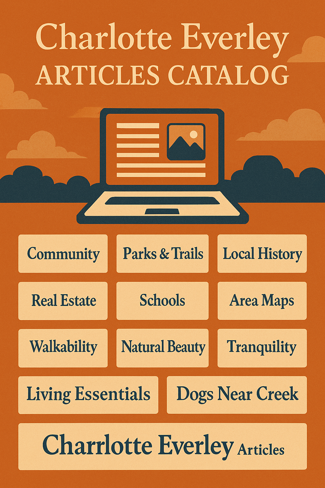

---

title: "Charlotte Everley Articles Catalog"
description: "An illustrated and evolving directory of lifestyle, culture, and home storytelling across the Main Line and beyond."
----------------------------------------------------------------------------------------------------------------------------------

Welcome to the curated catalog of Charlotte Everley's written and visual works. These articles reflect the elegance, depth, and regional intimacy of the Main Line lifestyle. Below is a decorative overview of articles created or in development — arranged by theme, awaiting publishing links.

## Charlotte Everley Articles Collection

This curated archive represents over a month of creative regional storytelling, from Devon to Berwyn, Valley Forge to Wayne.

---

## 🏡 Home & Property

* Devon Home: Stone, Sunlight, and Substance
* Architectural Harmony in Berwyn’s Historic Corridors
* Quiet Geometry: Contention & Hickory as a Corner of Calm
* Property History of Devonshire: From Farmland to Foundry

## 🌿 Nature & Preservation

* Walkable Nature: Trails, Trees & Wildlife Sanctuaries
* Valley Creek & Duportail Buffers: The Ecological Fold
* Horse Shoe Trail to Covered Bridges: A Path Through Time
* Praying Mantis and Native Flora Along the Arboretum Fringe

## 📚 Education & Culture

* Blue Ribbon Radius: K–12 Culture & Logistics
* School Schedules, Parent Coordination & Bus Routes
* Shipley, Baldwin, and the Private School Heritage
* Public Library Systems & Friends Societies: A Quiet Power

## 🎨 Art & Society

* Plein Air Festivals and the Devon Tile Legacy
* Wayne Art Center: Mosaic of Modern and Classical
* Musical and Theatrical Footprints of the Main Line
* Infographics & Illustrated Histories: From Farm Roads to Forums

## 🕊️ Historical Threads

* Lafayette’s March: From Valley Forge to Yellow Springs
* Black Migration Routes & Church Districts in Wayne & Berwyn
* Washington’s Headquarters & Devon’s Revolutionary Echoes
* Women’s Rights & Civil Stride Timeline in Valley Forge Area

## 🧭 Local Infrastructure & Living

* Strategic Roads: From Waterloo to Sugartown
* Covered Bridges, Cemeteries & Old School Roads
* Pets & Volunteerism as Empathy Metrics
* Transportation, Police, and Hospital Access Points

---

> Each article captures not just a place — but its atmosphere, its context, and its quiet persuasion.

Stay tuned as we continue to publish and link these features across CharlotteEverley.foundral.tech

